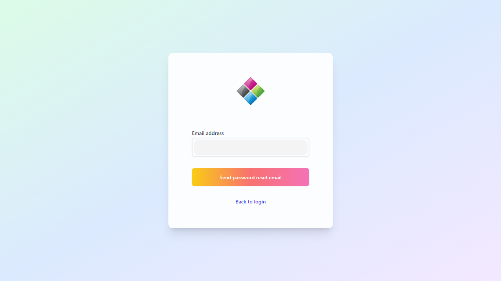

## Application Features
1. In general:
   - Engaging and non-distracting web design.
   - Pleasant, not overwhelming, to the eyes.
   - Simple but informative, guiding users through the features without creating any confusions.
   - Google-level security
      - Set up Content Security Policy to mitigate and detect XSS attacks.
      - Rejects requests without valid Firebase application ids to prevent unauthorized server endpoint access.
      - Expires tokens after each request to prevent replay attacks.
      - Rate limits each ip (and VPNs). Considered the possibility where the application uses a proxy by checking the `x-forwarded-for` header as a backup option for ip.
      - Data are stored in Google's Firebase.
      - Anti-DDoS.
2. Login:
   - **SignUpForm:** Allows users to sign up using their email and password, and validates the input fields using regular expressions and conditions.
   - **LoginForm:** Allows users to log in using their email and password, and securely validates the input fields using Firebase.
   - **SocialLogin:** Allows users to log in using a social media account - Google, GitHub, or Twitter (X) - and redirects them to the chat page if successful.
   - **ForgotPassword:** Allows users to reset their password and sends them an email to their inbox with a link to recover their account.
3. Chat:
   - **NavBar**: Personalize your experience with your name and profile picture, and navigate to Draw, Dashboard, Chat, or Logout with one click.
   - **ChatHeader**: Allows users to hover over an info icon to see a walkthrough of the chat interface. 
   - **Export**: Export & save the current chat session in a txt, json, or pdf format.
   - **Chatbot**: Allow users to chat with a LLM that can view and describe image contents without exposing API keys by securely requesting Firebase Functions server endpoints for HuggingFace API requests.
   - **ChatContent**: Starts and saves chat history to Firebase Firestore in an intuitive structure:
```
<user_id>: {
   chatSessions: {
      <chatsessionId 1>: {
         name: <session name>,
         timestamp: <session timestamp>,
         messages: [[<user msg 1>, <ai msg 1>], [<user msg 2>, ...], ...]
      },
      <chatsessionId 2>: ...
   },
   tokenCounts: {
      requestTokenCounts: [
         {date: <date 1> /* new Date().toDateString() * /, count: <token count>},
         {date: <date 2>, count: <token count>},
         ...
      ],
      responseTokenCounts: [
         {date: <date 1>, count: <token count>},
         {date: <date 2>, count: <token count>},
         ...
      ]
   },
   drawContent: {
      requestCounts: [
         {date: <date 1>, count: <request count>},
         {date: <date 2>, count: <request count>},
         ...
      ],
      imageUrls: [
         {prompt: <prompt 1>, url: <image url 1>},
         {prompt: <prompt 2>, url: <image url 2>},
         ...
      ]
   }
}
```
   - **Settings**: Fine-tune your chat experience with adjustable parameters in the form of cute input boxes and sliders for system message, max tokens, temperature, top-p, presence penalty, and count penalty.
   - **ChatSessions**: Displays a list of the user's saved chat sessions on the left side of the UI. Users can reload & continue in a previous chat session, update the session name, or remove the session with a single click.
4. Special Effects
   - Toggle between light, dark, and purple dark modes.
   - Creates a 3D effect for elements by default, and animates a 3D pop-out effect when a mouse hovers over buttons, tags, and Tailwind cards.
   - Generates a radial ripple effect when user clicks on buttons.
   - Smooth transitions between sections & pages.

 - [ ] Release Draw page
 - [ ] Release Dashboard page
 - [ ] Dynamic AES encryption

## Development Practices
1. Refactored code by creating reusable and customizable components to build a foundation for fast feature development & changes.
2. Applied SOLID principles for clean & maintainable code.
3. Implemented SPA for optimized page loads, and the fastest routing.
4. Used ESLint for writing more readable code.
5. Applied mobile-first design to ensure a modern and sleek web design that's responsive across all devices.

## Sample Pages
https://mini-agi.web.app/chat


<br>

https://mini-agi.web.app/


<br>

https://mini-agi.web.app/login


<br>

https://mini-agi.web.app/forgot-password


## Getting Started

1. Store secrets in `.env`:
```env
LLM_ENDPOINT="https://api-inference.huggingface.co/models/microsoft/Phi-3-mini-128k-instruct"
TOKENIZER_JSON="https://huggingface.co/microsoft/Phi-3-mini-128k-instruct/raw/main/tokenizer.json"
FIREBASE_API_KEY=""
FIREBASE_AUTH_DOMAIN=""
FIREBASE_PROJECT_ID=""
FIREBASE_STORAGE_BUCKET=""
FIREBASE_MESSAGING_SENDER_ID=""
FIREBASE_APP_ID=""
```
Follow the setup guide at https://firebase.google.com/docs/web/setup#add_firebase_to_your_app if you are new to Firebase.

2. Secure your Firebase setup:
   - Go to https://console.cloud.google.com/apis/credentials
   - Select your project
   - Under API keys, click on "Browser key (auto created by Firebase)"
   - Under "Set an application restriction", click on Website and add the URL of your app to prevent unauthorized access (read more at [Is it Safe to Expose Firebase APIKey to the Public](https://stackoverflow.com/questions/37482366/is-it-safe-to-expose-firebase-apikey-to-the-public))

3. Set up Firebase Functions in your project root directory using `firebase init functions`. This application sends requests to the HuggingFace API on the Firebase Functions server so that any API keys are not exposed to the client side. So, please set any environmental variables on the server using `firebase functions:config:set huggingface.api_key="your_api_key"`.

4. Lastly, deploy the application to Firebase:

```bash
firebase deploy --only "functions,hosting"
```

---

## Attribution

FreePik, <a href="https://www.freepik.com/icon/illustrator_6422688#fromView=popular&page=1&position=94&uuid=99aa81c8-6fe0-4e01-9741-b41c3722d69c">Icon by UIcons</a>
